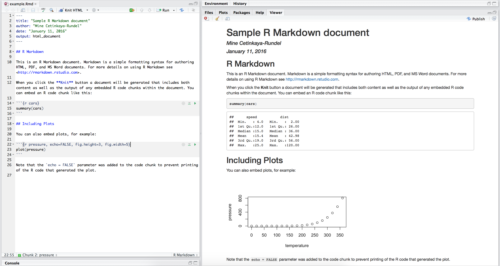

class: center, middle

# Literate Programming

---

## Donald Knuth "Literate Programming (1983)"

"Instead of imagining that our main task is to instruct a *computer* what 
to do, let us concentrate rather on explaining to *human beings* what we 
want a computer to do."

"The practitioner of literate programming [...] strives for a program that 
is comprehensible because its concepts have been introduced in an order 
that is best for human understanding, using a mixture of formal and 
informal methods that reinforce each other."

- These ideas have been around for years!
- And tools for putting them to practice have also been around
- But they have never been as accessible as the current tools: R Markdown

---

## What is Markdown?

- Markdown is a lightweight markup language for creating HTML (or XHTML) 
documents.

- Markup languages are designed to produce documents from human readable 
text (and annotations).

- Some of you may be familiar with LaTeX. This is another (less human 
friendly) markup language for creating pdf documents.

- Why I love Markdown:
    + Simple syntax means easy to learn and use.
    + Focus on **content**, rather than **coding** and debugging 
    **errors**.
    + Allows for easy web authoring.
    + Once you have the basics down, you can get fancy and add HTML,
    JavaScript, and CSS.

---

## Sample Markdown document

---

## What is R Markdown?

Well, it's R + Markdown:

- Ease of Markdown syntax

- Rendering of R code to produce output and plots

- Ability to include LaTeX: $\hat{y} = \beta_0 + \beta_1 \times x$

---

## Sample R Markdown document

---

## Another R Markdown document

    

This presentation!

---

class: center, middle

# R Markdown

---

## It's your lucky day!

You got some data.

- `WorldCupMatches-01.csv`: Match info for each game in pre-2000 World Cups
- Codebook at https://github.com/mine-cetinkaya-rundel/repro-compute-isba18/blob/master/01-lit-program/data/README.md#codebook
- Ultimate goal: Visualize the total number of goals for each World Cup over time.

.instructions[
Open `world-cup-goals.Rmd`. Knit the document. Then, update the *yaml* with your information, and knit again.
]

---

