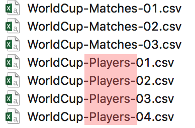
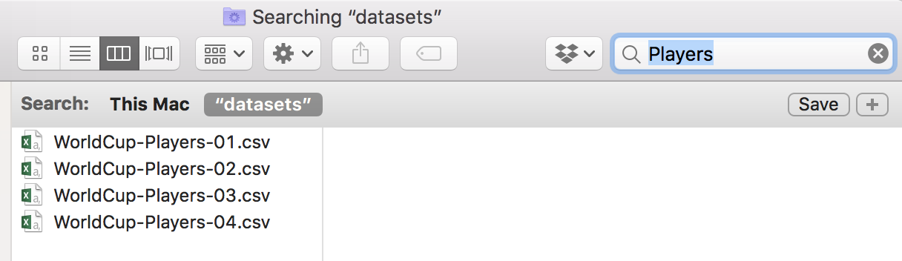

## What works, what doesn't?

**NO**

~~~
myabstract.docx
Joe’s Filenames Use Spaces and Punctuation.xlsx
figure 1.png
fig 2.png
JW7d^(2sl@deletethisandyourcareerisoverWx2*.txt
~~~

**YES**

~~~
2014-06-08_abstract-for-sla.docx
joes-filenames-are-getting-better.xlsx
fig01_scatterplot-talk-length-vs-interest.png
fig02_histogram-talk-attendance.png
1986-01-28_raw-data-from-challenger-o-rings.txt
~~~

---

## Three principles for (file) names

1. Machine readable

2. Human readable

3. Plays well with default ordering

---

class: center, middle

# Machine readable

---

## Machine readable

- Regular expression and globbing friendly: Avoid spaces, punctuation, accented 
characters, case sensitivity

- Easy to compute on: Deliberate use of delimiters
    
---

## Globbing

**Excerpt of complete file listing:**



<br>

**Example of globbing to narrow file listing:**

```
mine:datasets mine$ ls *Players*
WorldCup-Players-01.csv	WorldCup-Players-03.csv
WorldCup-Players-02.csv	WorldCup-Players-04.csv
```
---

## Same using Mac OS Finder search facilities



---

## Same using regex in R

```
> library(fs)
> dir_ls(glob = "*Players*")
WorldCup-Players-01.csv WorldCup-Players-02.csv WorldCup-Players-03.csv 
WorldCup-Players-04.csv 
```

---

## Punctuation

Deliberate use of `"-"` and `"_"` allows recovery of meta-data from the filenames:

- `"_"` underscore used to delimit units of meta-data you might want later
- `"-"` hyphen used to delimit words

---

## Recap: Machine readable

- Easy to search for files later

- Easy to narrow file lists based on names

- Easy to extract info from file names, e.g. by splitting

- New to regular expressions and globbing? be kind to yourself and avoid
    + Spaces in file names
    + Punctuation
    + Accented characters
    + Different files named `foo` and `Foo`

---

class: center, middle

# Human readable

---

## Human readable

- Name contains info on content

- Connects to concept of a *slug* from semantic URLs

---

## Example

**Which set of file(name)s do you want at 3 a.m. before a deadline?**


---

## Recap: Human readable

Easy to figure out what it is, based on its name

---

class: center, middle

# Plays well with default ordering

---

## Plays well with default ordering

- Put something numeric first

- Use the ISO 8601 standard for dates

- Left pad other numbers with zeros

---

## Examples

**Chronological order:**


**Logical order:** Put something numeric first


---

## Dates

Use the ISO 8601 standard for dates: YYYY-MM-DD


---

## 


---

## Comprehensive map of all countries in the world that use the MM-DD-YYYY format


<br>

From https://twitter.com/donohoe/status/597876118688026624.

---

## Left pad other numbers with zeros


<br>

If you don’t left pad, you get this:

~~~
10_final-figs-for-publication.R
1_data-cleaning.R
2_fit-model.R
~~~

which is just sad :(

---

## Recap: Plays well with default ordering

- Put something numeric first

- Use the ISO 8601 standard for dates

- Left pad other numbers with zeros

---

class: center, middle

## Recap

---

## Three principles for (file) names

1. Machine readable

2. Human readable

3. Plays well with default ordering

<br>

Pros

- Easy to implement NOW

- Payoffs accumulate as your skills evolve and projects get more complex
