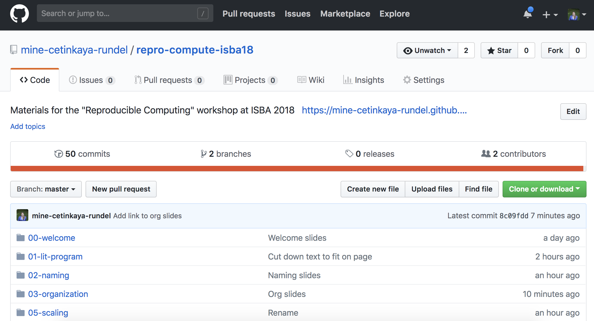
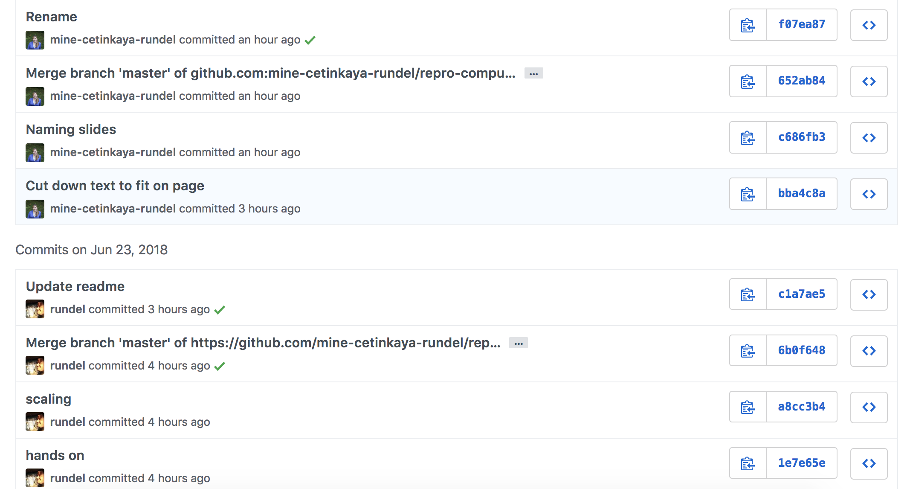
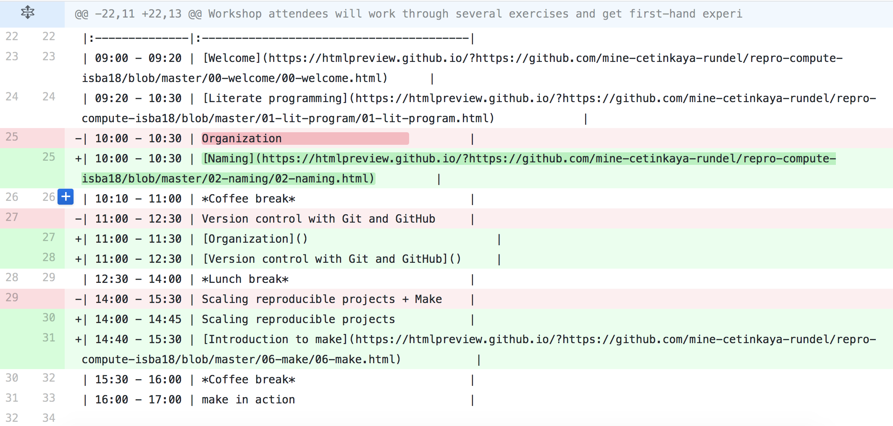
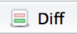

class: center, middle

# Version control

---

## What is version control?

Version control is a system that records changes to a file or set of files over time so that you can recall specific versions later.

---

## Bad


<br><br>

<font size="3">Source: Piled Higher and Deeper by Jorge Cham, http://www.phdcomics.com.</font>

---

## Good

~~~
    2013-10-14_manuscriptFish.doc
    2013-10-30_manuscriptFish.doc
    2013-11-05_manusctiptFish_intitialRyanEdits.doc
    2013-11-10_manuscriptFish.doc
    2013-11-11_manuscriptFish.doc
    2013-11-15_manuscriptFish.doc
    2013-11-30_manuscriptFish.doc
    2013-12-01_manuscriptFish.doc
    2013-12-02_manuscriptFish_PNASsubmitted.doc
    2014-01-03_manuscriptFish_PLOSsubmitted.doc
    2014-02-15_manuscriptFish_PLOSrevision.doc
    2014-03-14_manuscriptFish_PLOSpublished.doc
~~~

---

## Better - Saving everything together at once

Everytime you make a save, you zip the entire directory that your project files are in and save it with a date.

---

## Best - Version Control

<center>

</center>

<br><br>

<font size="3">Source: https://github.com/mine-cetinkaya-rundel/make-research-repro-unc-psy831</font>

---

## Version control systems

- Start with a base version of the document, save just the changes you made at each step of the way.
- Think of it as a tape: if you rewind the tape and start at the base document, then you can play back each change and end up with your latest version.
<center>

</center>
- "Playing back" different sets of changes onto the base document and getting different versions of the document.
<center>

</center>

<font size="3">Source: [Software Carpentry](https://software-carpentry.org/).</font>

---

## Git/GitHub

- Easy to set up
- Integrated with RStudio
- GitHub's strong community: your colleagues are probably already there
- Provides tools to help enhance collaboration
- A common location to share your work

---

## Commits

<center>

</center>

---

## Diff

<center>

</center>

---

class: center, middle

# Git in GitHub

---

## GitHub

If you don't have a GitHub account

- Go to github.com
- Sign up with a username, email, and password

---

## Username advice

- Incorporate your actual name! People like to know who they’re dealing with. Also makes your username easier for people to guess or remember.
- Reuse your username from other contexts, e.g., Twitter or Slack. But, of course, someone with no GitHub activity will probably be squatting on that.
- Pick a username you will be comfortable revealing to your future boss.
- Shorter is better than longer.
- Be as unique as possible in as few characters as possible. In some settings GitHub auto-completes or suggests usernames.
- Make it timeless. Don’t highlight your current university, employer, or place of residence.
- Avoid words laden with special meaning in programming.

---

## Overview

In this activity you are going to learn how to collaborate using Github.  With a partner you will learn some basics which allow you to share and edit files on Github. 

1. Create a git repository hosted at GitHub
2. Build `README.md` file 
3. Commit changes to repository
3. Collaborate by forking and editing partners file

---

## Create a repository with a README.md file

**Step 1**: First we are going to create a repository within our Github user account. 

1. Go to your Github profile. The url should be `http://github/[your-user-name]`.
2. Create a new Github repository, click the green "New" button, under the repositories tab.
3. Name your repository `test-repo`.
4. In the details write "Test repo for workshop".
5. Click the initiate a `README.md file` option. 

---

## So far

-  A **repository** is a directory (folder) that houses both the files of a project AND the git history of the project.
-  Once the repository is created you will be directed to the repository page which now has its own web address. 
-  Each repository on Github has a unique url so you can easily share. 
-  The git history is a detailed history of all the changes made to that file.  One of the features of using Github is the ability to view your repository history which are displayed in the Graphs section of your Github repository page. 
-  At this point in the git history of your `test-repo` repository there is only one commit.

---

## Edit the `README.md` file

1.  Go back to the `test-repo` repository main page. Click on `README.md`, then click "edit this file". Add some random text to the `README.md` file:

**Tip:**  Notice that you can use markdown syntax. Use [this guide](https://help.github.com/articles/markdown-basics/) for Github's flavor of Markdown. Use the "Preview" button to view the formatting of your readme.md file. 

---

## Commit

- **Commit** takes a snap shot of your project. Each commit includes a commit message that concisely defines changes made or project state at the time of the commit. 

1. Summarize the changes that you have made in 50 characters or less and click the green "commit button". 
2. Check out the git history.  You should now see two commits.

---

## Collaborate

Now it is time to collaborate with your partner.  Navigate to your partner's repository by typing the url directly into your address bar. In order to edit someone else's repository you usually follow this simplified work flow: 

1. Fork their repository to your user account 
2. Make edits and commit 
3. Create a pull request that merges your changes into their repository. 

**Tip:** Depending on the project there are variations on the above work flow. Often the rules for contributing to a project are outlined in a file called `CONTRIBUTING.md` within the repository. One of the more often used works flows is [Github Flow](https://guides.github.com/introduction/flow/). 

---

## Forking

- **Forking** is creating a copy of a git repository into your own account.  
-  Forking allows you to make changes to a repository without affecting the main repository of the project.  
-  This is one of the most exciting aspects of Github - you essentially encouraged to copy and play with anyone's code! 

--

1.  To fork your partner's repository click the "fork" button in the top left hand part of your screen.  
2.  When it asks where you would like to fork the repository, choose your user account (if you are new to Github, this should be the only option).

---

## Make edits and commit

- You should now have a copy of your partners repository, `work-organization-their-name`. 
-  Github keeps track of the entire git history of the project and all forked copies made of the project. 

1. Edit your partners repository by clicking the edit button.  
2. Paste in the answers to your questions under theirs and make a commit. 

---

## Create a pull request

- A **pull request** is the final step in the collaboration process, essentially asking if the edits made to your copy can be incorporated into another repository. 

1.  Make sure you are in your copy of your partner's repository by looking at the url - your user name should preface the repository name.  
2.  Click the green "New Pull Request" button. You will get an overview of the changes you made to the repository. 
3.  Click the "Create a Pull Request" button to continue the pull request. Your partner will now get a notification of a pull request on their main repository, as will you if your partner made changes. 
4.  Go ahead and accept this pull request. 

---

class: center, middle

# Git in RStudio

---

## Git config

- Go to the Terminal pane

- Type the following two lines of code, replacing the information in the quotation marks with your info:

```shell
git config --global user.email "your email"
git config --global user.name "your name"
```

For example, for me these are

```shell
git config --global user.email "mine@stat.duke.edu"
git config --global user.name "Mine Cetinkaya-Rundel"
```

To confirm that the changes have been implemented, run the following

```shell
git config --global user.email
git config --global user.name
```

---

## Other useful git config options

For certain operations GitHub will require that you authenticate, in order to avoid having to type your username and password repeatedly we can ask git to cache our credentials

```shell
git config --global credential.helper 'cache --timeout=600000'
```

This will cache your username password for 600,000 seconds, or ~1 week. This cacheing occurs only on the machine where this is set (and where authentication occured) and when using https based url.

---

## Follow along demo

**Step 1:** Fork a repository. (Need inspiration? Fork this [one](https://github.com/rundel/repro-compute-isba18-demo).)

**Step 2:** Clone your forked repository to obtain a local copy of the files into an RStudio project.

**Step 3:** Edit a file in this repository/project.

**Step 4:** Stage your changes to be committed.

**Step 5:** View the diff, and commit your changes, with a commit message.

**Step 6:** Push your changes to your own fork of the the GitHub repository.

---

## Step 1: Fork

**Fork a repository.**

<br>

1. Go to a repository.
2. Click on Fork (on the top right corner).

---

## Aside: Where am I?

**How can I tell if I am looking at my fork or the original repository?**

- Look at the URL.
- Look at the name of the repo on the upper left corner, for your fork it will say:

~~~
[your-github-name]/repro-compute-isba18-demo
forked from rundel/repro-compute-isba18-demo
~~~

---

## Step 2: Clone

**Clone your forked repository to obtain a local copy of the files .**

<br>

1. In RStudio, go to File, and then New Project
2. Click on *Version Control: Checkout a project from a version control repository*
3. Click on *Git: Clone a project from a repository*
4. Fill in the info:
    - URL: use HTTPS address
    - Create as a subdirectory of: Browse to where you would like to create this folder
        
---

## What is .gitignore?

Git uses this file to determine which files and directories to ignore, before you make a commit.

---

## Step 3: Edit

**Edit a file in this repository/project.**

<br>

1. Change the output to `github_document`
2. Update the YAML with your information
3. Add additional text, code, plot as you like

---

## Step 4: Stage

**Stage your changes to be committed.**

<br>

1. Go to the Git pane in RStudio.
2. Stage the changes for the changed file(s) by checking the boxes next to then, and hit Commit.

<br><br>

---

## Step 5: Commit

**View the diff, and commit your changes, with a commit message.**

<br>

1. In the pop-up window view the *diff* for the Rmd file. You can view it for the HTML file as well if you like.
2. Enter an **informative** commit message, like "Changed analysis year to X", and hit Commit.

---

## Step 6: Push

**Push your changes to your own fork of the the GitHub repository.**

**push**: When using git push always means pushing commits from your local respository (your computer) to a remote repository (Github).

<br>

1. Now push your changes to GitHub by hitting Push.
2. Enter login information as needed.

---

class: center, middle

# Other day one essentials

---

## More info on the Git pane

File tracking:

- The RStudio Git pane lists every file that’s been added, modified or deleted. 

- The icon describes the change:
    +  **Modified:** You changed the contents of the file.
    +  **Untracked:** You added a new file that Git hasn't seen before.
    +  **Deleted:** You deleted a file.

You can get more details about modifications with a :

- Green: added text
- Red: removed text
